# Options Pricer & Greeks Analyzer

Pricing analytique et Monte Carlo d'options européennes Black-Scholes, calcul des Greeks, analyse de la surface de volatilité implicite et simulation de la couverture delta-neutre.

---

## Objectif

Ce projet implémente de bout en bout la valorisation d'options européennes vanilles sous le modèle Black-Scholes : prix analytiques (call et put), Greeks du premier et second ordre, analyse des sensibilités aux paramètres de marché, validation indépendante par simulation Monte Carlo, inversion numérique de la volatilité implicite sur données réelles (SPY via yfinance), et simulation de la couverture delta-neutre avec décomposition du P&L.

Il couvre la chaîne complète **pricing → Greeks → volatilité implicite → couverture dynamique**, du modèle théorique à sa mise en œuvre sur données réelles et à la simulation d'une stratégie de réplication delta-neutre.

---

## Méthodes

### Black-Scholes analytique

Sous la mesure risque-neutre, le prix d'un call européen est :

$$C = S \cdot N(d_1) - K e^{-rT} N(d_2)$$

$$d_1 = \frac{\ln(S/K) + \left(r + \frac{\sigma^2}{2}\right)T}{\sigma\sqrt{T}}, \qquad d_2 = d_1 - \sigma\sqrt{T}$$

La parité call-put $C - P = S - Ke^{-rT}$ est vérifiée analytiquement (erreur $< 10^{-9}$).

### Greeks analytiques

| Greek | Formule (call) | Interprétation |
|-------|---------------|----------------|
| $\Delta$ | $N(d_1)$ | Exposition directionnelle au sous-jacent |
| $\Gamma$ | $n(d_1) / (S\sigma\sqrt{T})$ | Convexité — vitesse de variation du delta |
| $\mathcal{V}$ | $S n(d_1)\sqrt{T} / 100$ | Sensibilité à la volatilité implicite (+1 pt) |
| $\Theta$ | $\left[-\frac{S n(d_1)\sigma}{2\sqrt{T}} - rKe^{-rT}N(d_2)\right] / 365$ | Érosion temporelle par jour |
| $\rho$ | $KTe^{-rT}N(d_2) / 100$ | Sensibilité au taux sans risque (+1 pt) |

### Greeks de second ordre

Les Greeks de second ordre mesurent la sensibilité des sensibilités — comment le hedge
lui-même évolue quand les conditions de marché changent. Ils sont validés par différences
finies centrées (écarts $< 10^{-6}$ vs analytique).

| Greek | Formule | Définition |
|-------|---------|-----------|
| **Vanna** | $-n(d_1) d_2/\sigma$ | $\partial\Delta/\partial\sigma = \partial\mathcal{V}/\partial S$ — sensibilité croisée spot/vol |
| **Volga** | $S n(d_1)\sqrt{T} d_1 d_2/\sigma$ | $\partial\mathcal{V}_{\text{brut}}/\partial\sigma$ — convexité par rapport à la vol |
| **Charm** | $-n(d_1)(2rT - d_2\sigma\sqrt{T}) / (2T\sigma\sqrt{T})$ | $-\partial\Delta/\partial T$ — delta bleed (variation du delta par jour) |

Vanna et Volga sont identiques pour le call et le put. Charm est analytiquement identique
(le terme $-1$ de $\Delta_{\text{put}} = N(d_1)-1$ disparaît à la dérivation).

### Volatilité implicite

La formule Black-Scholes n'a pas de forme fermée pour $\sigma$ : il n'existe pas d'inverse analytique $\sigma = f(C, S, K, T, r)$. La volatilité implicite s'obtient par inversion numérique — on cherche $\hat{\sigma}$ tel que $\text{BS}(\hat{\sigma}) = C_{\text{marché}}$.

L'algorithme utilise **Newton-Raphson** :

$$\sigma_{n+1} = \sigma_n - \frac{\text{BS}(\sigma_n) - C_{\text{marché}}}{\mathcal{V}_{\text{brut}}(\sigma_n)}, \qquad \mathcal{V}_{\text{brut}} = S n(d_1)\sqrt{T}$$

Le Vega brut $S n(d_1)\sqrt{T}$ est la dérivée exacte de $\text{BS}$ par rapport à $\sigma$, ce qui garantit une convergence quadratique depuis $\sigma_0 = 0.2$. Si le Vega devient trop petit ($< 10^{-10}$) ou si Newton ne converge pas en 100 itérations, l'algorithme bascule automatiquement sur la méthode de **Brent** (`scipy.optimize.brentq`) sur $[10^{-6}, 5]$. Le solveur retourne `NaN` si le prix de marché est hors des bornes d'arbitrage.

### Surface de volatilité

Le même solveur `implied_vol` est appliqué sur l'ensemble des maturités disponibles pour
construire la surface complète $\sigma(K/S, T)$. Pour chaque expiration, on calcule les IV
strike par strike (puts OTM pour $K/S < 1$, calls OTM pour $K/S \geq 1$), puis on interpole
sur une grille de moneyness commune $[0.80, 1.20]$ à 40 points. Les courbes empilées forment
une matrice IV de dimensions $(n_{\text{maturités}} \times 40)$ qui se lit selon deux axes :
- **Transversal (skew)** : pente négative de l'IV en fonction du strike — queues épaisses et
  prime de krach encodées dans les prix.
- **Longitudinal (term structure)** : évolution de la vol ATM avec $T$ — structure croissante
  en régime normal, inversée en régime de stress.

### Simulation Monte Carlo

Chaque trajectoire suit le mouvement brownien géométrique (GBM) sous $\mathbb{Q}$ :

$$S_T = S_0 \exp\!\left[\left(r - \frac{\sigma^2}{2}\right)T + \sigma\sqrt{T} Z\right], \quad Z \sim \mathcal{N}(0,1)$$

Le prix est estimé par $\hat{C} = e^{-rT} \mathbb{E}^{\mathbb{Q}}[\max(S_T - K, 0)]$. L'erreur standard décroît en $1/\sqrt{N}$ (théorème central limite), vérifiée empiriquement par régression log-log.

### Couverture dynamique & P&L attribution

La couverture delta-neutre d'un call vendu est simulée sur une trajectoire GBM discrétisée en $n$ pas. À chaque rebalancement, la position en actions est ajustée pour annuler l'exposition directionnelle ; le cash résiduel court au taux $r$.

Le P&L incrémental se décompose par développement de Taylor :

$$\text{PnL}_{dt} \approx \underbrace{-\tfrac{1}{2}\Gamma\,(dS)^2}_{\text{coût gamma}} + \underbrace{|\Theta_{\text{ann}}|\,dt}_{\text{gain theta}} + \underbrace{r \cdot \text{cash} \cdot dt}_{\text{intérêts}} + \underbrace{\tfrac{1}{2}\Gamma S^2(\sigma_{\text{réal}}^2 - \sigma_{\text{impl}}^2)\,dt}_{\text{PnL vol (résidu)}}$$

Quand $\sigma_{\text{réal}} = \sigma_{\text{impl}}$, l'équation de Black-Scholes garantit que les termes gamma et theta se compensent en espérance (P&L $\approx$ 0 en espérance sur de nombreux chemins). Sur un chemin particulier, le résidu reflète l'écart entre la variance réalisée et la variance implicite.

L'erreur de réplication avec rebalancement discret scale comme $\sqrt{T/n}$ : la couverture quotidienne ($n = 252$) produit une distribution de P&L nettement plus resserrée que l'hebdomadaire ($n = 52$), avec un ratio empirique $\approx \sqrt{252/52} \approx 2.2$.

---

## Résultats clés

Paramètres de référence : $S = K = 100$, $T = 1$ an, $r = 5\%$, $\sigma = 20\%$ (option ATM).

### Prix et Greeks

| Grandeur | Call | Put |
|----------|-----:|----:|
| **Prix Black-Scholes** | **10.4506** | **5.5735** |
| Delta | +0.6368 | −0.3632 |
| Gamma | 0.01876 | 0.01876 |
| Vega (par +1% $\sigma$) | +0.3752 | +0.3752 |
| Theta (par jour) | −0.01757 | −0.00454 |
| Rho (par +1% $r$) | +0.5323 | −0.4189 |

### Validation Monte Carlo (N = 100 000 simulations)

| Grandeur | Valeur |
|----------|-------:|
| Prix MC | 10.4205 |
| Erreur standard | 0.0468 |
| IC 95 % | [10.329 ; 10.512] |
| Prix BS dans l'IC 95 % | **oui** |
| Erreur relative | **0.29 %** |
| Pente log-log mesurée | −0.500 (théorique : −0.5) |

---

## Visualisations

### 1. Prix call & put vs Spot

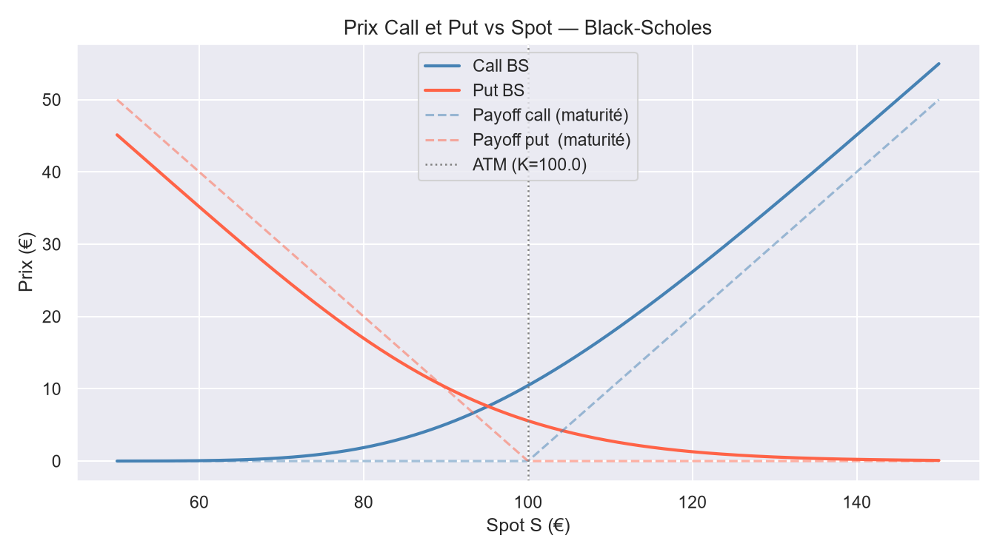

Le prix BS est toujours supérieur au payoff à maturité (valeur temps > 0). La valeur temps est maximale ATM et s'annule deep ITM/OTM. La convergence vers les droites de payoff pour $S \to 0$ et $S \to \infty$ confirme la cohérence du modèle.

### 2. Delta vs Spot

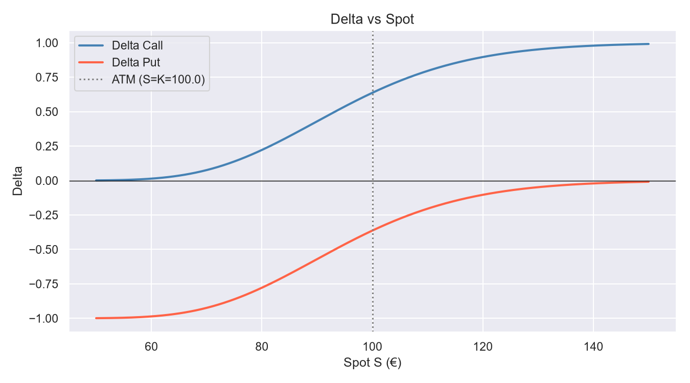

Le delta call vaut 0.64 ATM (et non 0.5) en raison du drift $r$ dans $d_1$. Sa forme sigmoïde illustre la non-linéarité de l'exposition : un portefeuille delta-neutre doit être rééquilibré continuellement lorsque le spot évolue. Le delta put est le symétrique par parité ($\Delta_P = \Delta_C - 1$).

### 3. Gamma & Vega vs Spot

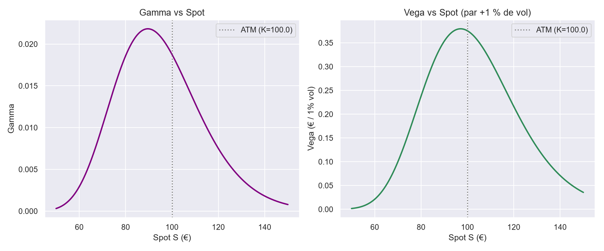

Gamma et Vega ont la même forme de cloche centrée ATM : ce sont les régions où la couverture est la plus coûteuse. Le centre de la cloche est légèrement décalé au-dessus du strike à cause de la distribution log-normale de $S_T$ (le mode est inférieur à la médiane). Un vendeur d'options est short Gamma et short Vega — il perd si la volatilité réalisée dépasse la volatilité implicite.

### 4. Theta vs Maturité

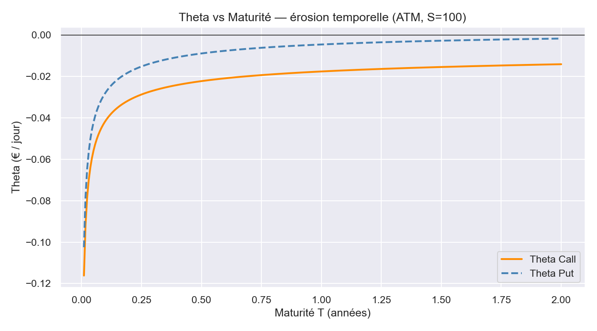

L'accélération de l'érosion temporelle à l'approche de la maturité ($T \to 0$) est caractéristique du terme $1/(2\sqrt{T})$ dans la formule du Theta. Un acheteur d'option supporte ce coût quotidien en échange de la convexité (Gamma positif) : c'est le fondement de la relation $\text{PnL} \approx \frac{1}{2}\Gamma(\Delta S)^2 + \Theta \Delta t$.

### 5. Convergence Monte Carlo

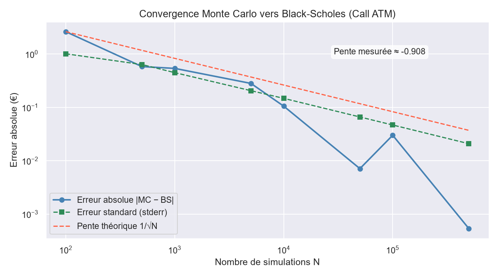

L'erreur absolue $|MC - BS|$ suit une droite de pente $-0.500$ en log-log, conforme à la décroissance théorique en $1/\sqrt{N}$. Avec 500 000 simulations, l'erreur tombe sous $0.005$ € ($< 0.05\%$). L'erreur standard suit le même régime, validant l'implémentation vectorisée NumPy.

### 6. Volatility Skew — SPY (données réelles yfinance)

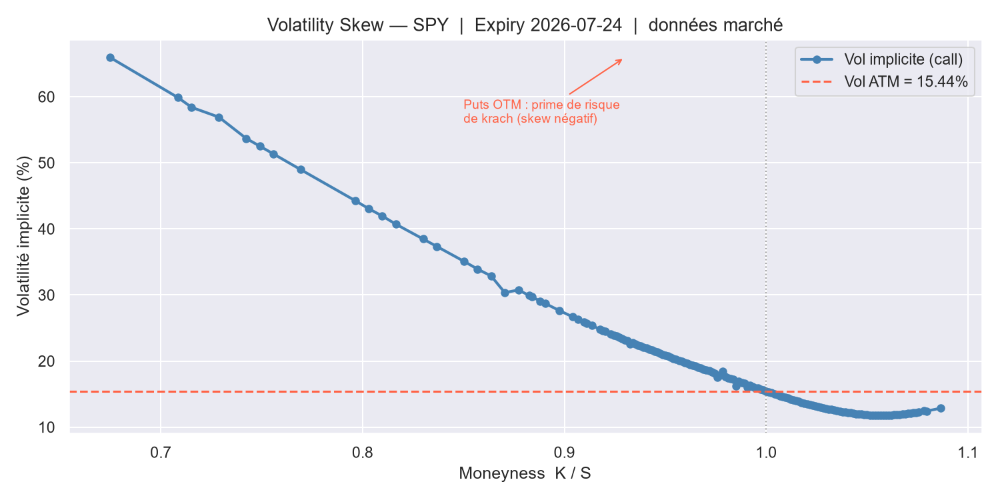

Volatilité implicite calculée sur la chaîne d'options SPY réelle (expiry juillet 2026, données live via `yfinance`) en fonction du moneyness $K/S$. La courbe est nettement décroissante : les puts OTM profonds ($K/S \approx 0.67$) cotent une IV de **66 %**, tandis que les calls OTM affichent **~12–14 %**, avec une vol ATM à **15.4 %**. Cette asymétrie — appelée **skew d'indice** ou *smirk* — reflète la prime de risque de krach : depuis 1987, les acheteurs de puts OTM paient une protection contre les baisses brutales, ce qui gonfle leur vol implicite bien au-delà de la vol ATM. C'est une preuve empirique directe que l'hypothèse de **volatilité constante** de Black-Scholes est fausse : un seul $\sigma$ ne peut pas pricer simultanément tous les strikes.

### 7. Surface de volatilité implicite 3D — SPY

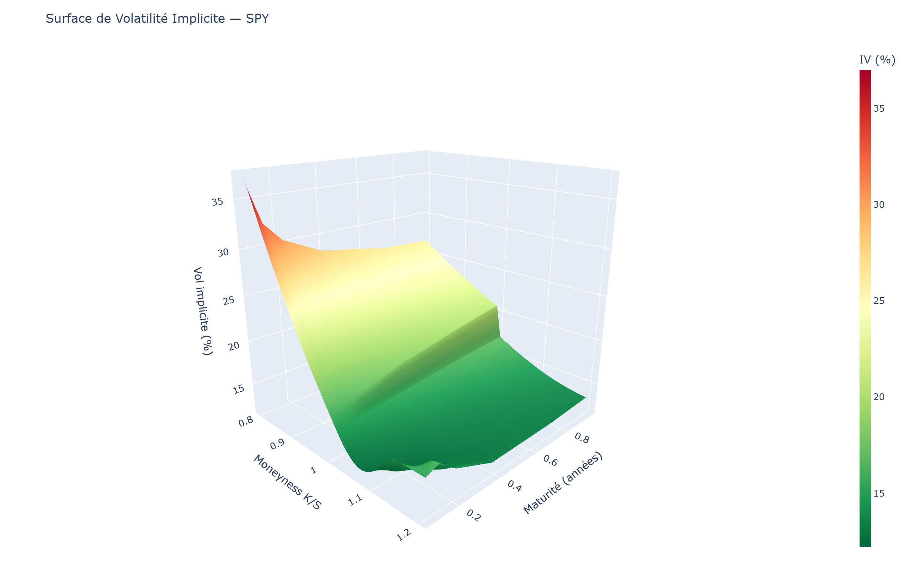

Carte complète du risque de volatilité sur SPY : 6 maturités (1 mois à 12 mois) × 40 points de moneyness, IV entre 12 % et 37 %. La surface révèle simultanément le skew d'indice (pente négative selon $K/S$) et la term structure (progression selon $T$) ; la version interactive `figures/08_vol_surface.html` permet de la faire pivoter librement.

### 8. Skew par maturité — aplatissement avec T

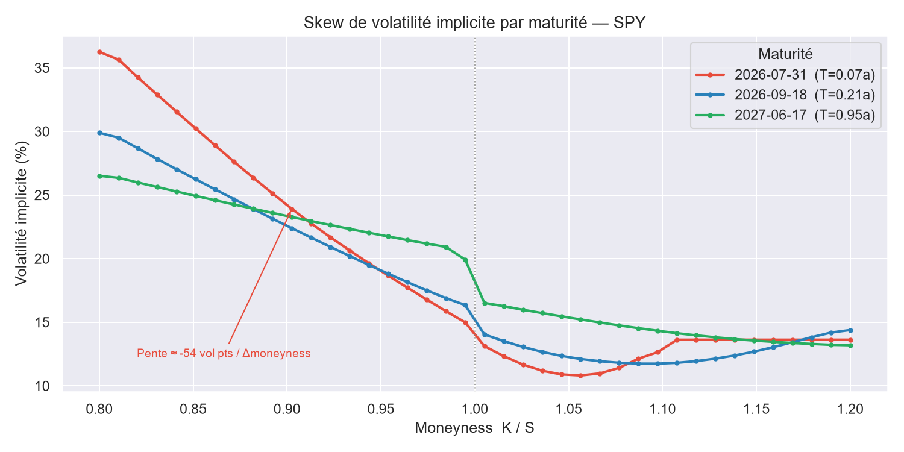

Superposition du skew pour trois maturités (court, moyen, long terme). Le skew s'aplatit à mesure que $T$ augmente : sur un horizon court, le marché anticipe des chocs brusques qui gonflent fortement la prime des puts OTM ; sur un horizon long, la variance s'homogénéise et l'écart entre puts OTM et calls OTM se resserre.

### 9. Term structure ATM — régime de marché normal

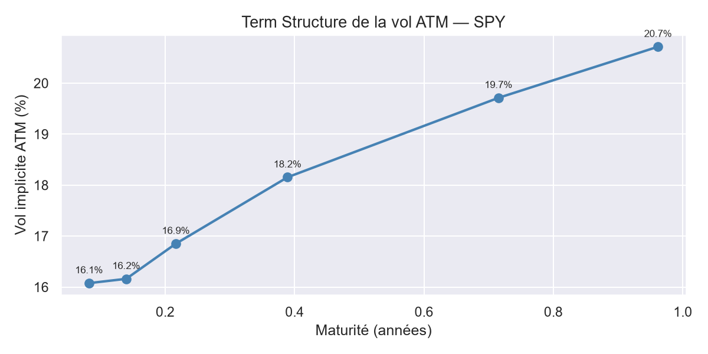

Vol implicite ATM en fonction de la maturité : 16.1 % à 1 mois, 20.7 % à 12 mois. Cette structure **croissante** (contango de volatilité) caractérise un régime de marché normal — la vol courte terme est ancrée sur la vol réalisée récente, tandis que la vol longue terme intègre une prime d'incertitude supplémentaire. Une structure inversée (court terme > long terme) signalerait un stress aigu ou un événement de marché imminent.

### 10. Vanna vs Spot

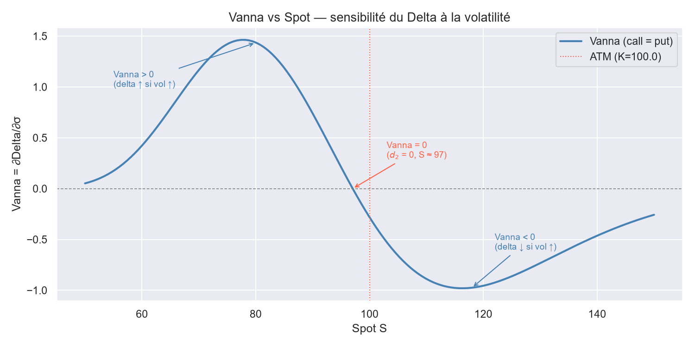

La Vanna change de signe à l'ATM : négative entre OTM et ATM (le delta call *diminue* quand la vol monte), positive entre ATM et ITM, nulle aux extrêmes quand $n(d_1) \to 0$. Le skew de volatilité implicite est en grande partie du risque Vanna mal couvert : les traders qui achètent des puts OTM sont longs Vanna, ce qui force les market makers à se couvrir en vendant du delta lors des baisses — amplifiant le mouvement.

### 11. Volga vs Spot

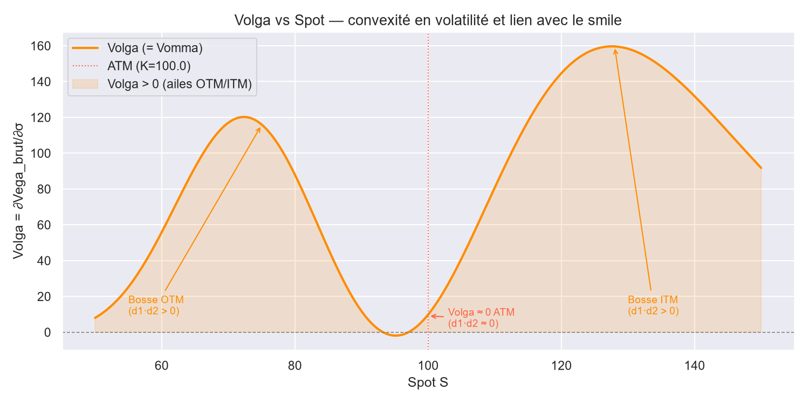

Le Volga présente deux bosses symétriques de part et d'autre du strike, et est **nul exactement ATM** ($d_1 \cdot d_2 \approx 0$). Sur les ailes OTM et ITM, le produit $d_1 d_2 > 0$ et le Volga devient positif : les options hors de la monnaie ont une convexité en vol croissante. C'est le lien direct avec le smile — le marché surpaye les options OTM pour couvrir ce coût de Volga, produisant une IV plus élevée que ce que BS prédit.

### 12. Charm vs Spot — delta bleed

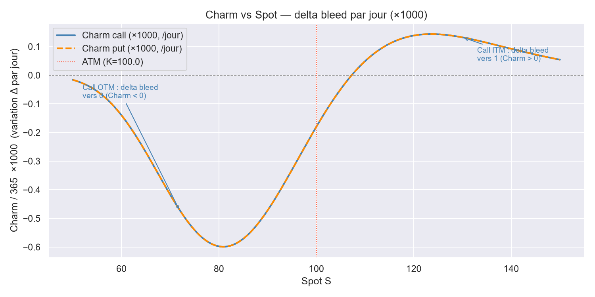

Le Charm (delta bleed) quantifie le rééquilibrage du delta imposé par le seul passage du temps, sans mouvement du spot ni de la vol. Les calls ITM voient leur delta progresser vers 1 (Charm > 0) ; les calls OTM voient leur delta régresser vers 0 (Charm < 0). Un trader delta-neutre le vendredi soir devra ajuster sa couverture le lundi matin même si le marché n'a pas bougé.

### 13. Charm vs Maturité — accélération en fin de vie

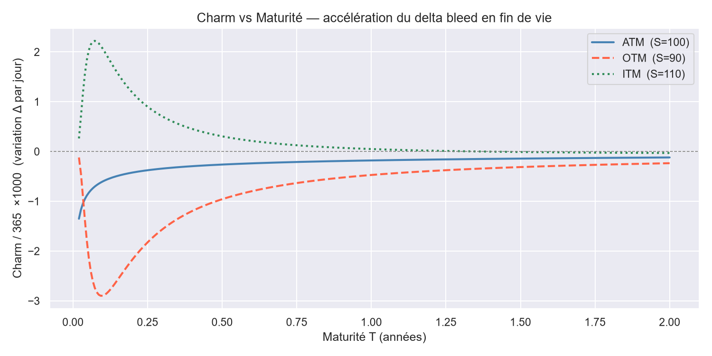

Comme le Theta, le Charm s'intensifie à l'approche de l'expiry : le delta bleed journalier est quasi nul à 2 ans et croît nettement sous les 2–3 mois. Les positions sur options courtes maturités exigent donc un rééquilibrage de delta plus fréquent, générant des coûts de transaction qui s'ajoutent à l'érosion du Theta.

### 14. Trajectoire spot & delta — couverture quotidienne

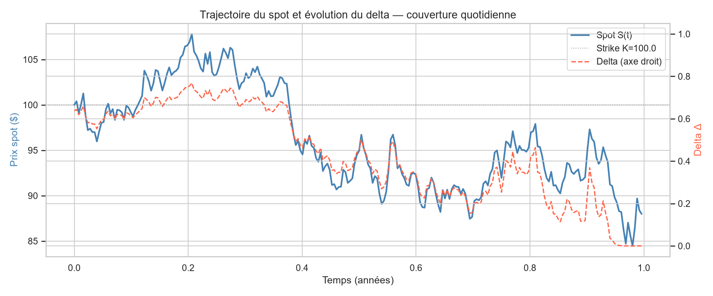

Évolution simultanée du spot (axe gauche) et du delta du call vendu (axe droit) sur 252 jours de couverture. Le delta suit le moneyness de l'option et converge progressivement vers 0 à mesure que le spot s'éloigne sous le strike — le call expire hors de la monnaie ($S_T \approx 88$). Chaque variation de delta correspond à un rebalancement de la position en actions.

### 15. Attribution du P&L — waterfall (short Gamma / long Theta)

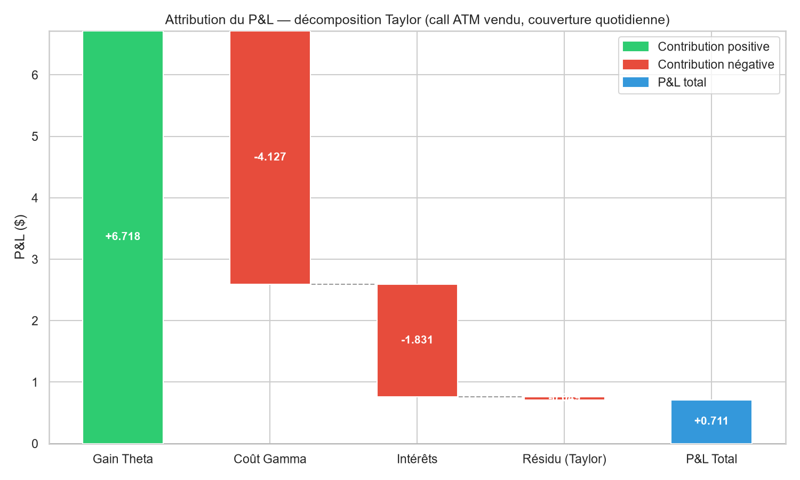

Décomposition Taylor du P&L sur la trajectoire de référence (seed 42) : le gain Theta (+6.72) dépasse le coût Gamma (−4.13) car la vol réalisée (18.7 %) est inférieure à la vol implicite (20 %) sur ce chemin — la position short vol est profitable. Le terme d'intérêts (−1.83) reflète le coût de financement de la couverture. Le résidu Taylor (−0.05) confirme la précision du développement au second ordre.

### 16. Distribution du P&L : quotidien vs hebdomadaire (1 000 simulations)

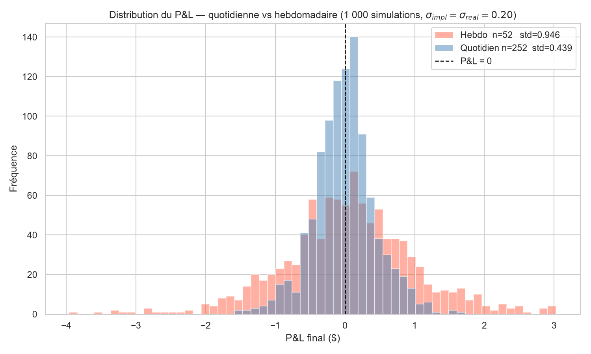

La couverture quotidienne ($n = 252$, std ≈ 0.45) est nettement plus resserrée que la couverture hebdomadaire ($n = 52$, std ≈ 1.0). Le ratio empirique std\_hebdo / std\_quotidien $\approx 2.15$ est conforme à la décroissance théorique en $\sqrt{T/n} = \sqrt{252/52} \approx 2.20$. Ce compromis est au cœur de la pratique : une fréquence de rebalancement plus élevée réduit l'erreur de couverture mais augmente les coûts de transaction.

### 17. P&L moyen du vendeur vs vol réalisée

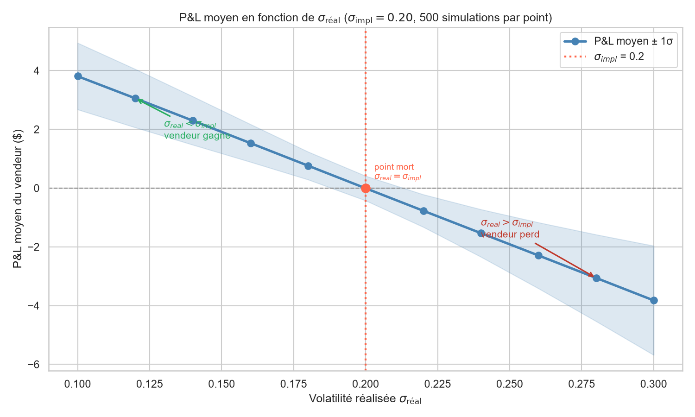

Le P&L moyen du vendeur est une fonction linéaire décroissante de $\sigma_{\text{réal}}$ (500 chemins par point, $\sigma_{\text{impl}} = 20\%$ fixé). Le point mort se trouve exactement à $\sigma_{\text{réal}} = \sigma_{\text{impl}}$ : le vendeur gagne si le marché réalise moins de volatilité que l'implicite, et perd dans le cas contraire. En espérance : $\mathbb{E}[\text{PnL}] \approx -\frac{1}{2}\int_0^T \Gamma_t S_t^2 (\sigma_{\text{réal}}^2 - \sigma_{\text{impl}}^2)\,dt$ — le vendeur d'option est fondamentalement un **vendeur de variance**.

---

## Structure du projet

```
options-pricer/
├── src/
│   ├── black_scholes.py     # Pricing BS analytique (call, put, parité)
│   ├── greeks.py            # Greeks 1er ordre (Δ,Γ,V,Θ,ρ) + 2nd ordre (Vanna,Volga,Charm)
│   ├── monte_carlo.py       # Pricer Monte Carlo vectorisé (GBM, seed reproductible)
│   ├── implied_vol.py       # Solveur de vol implicite (Newton-Raphson + Brent)
│   └── delta_hedge.py       # Simulation couverture delta-neutre + P&L attribution
├── notebooks/
│   ├── 03_sensibilites.ipynb         # Analyse des sensibilités et surface 3D Plotly
│   ├── 04_monte_carlo.ipynb          # Convergence MC vs BS en log-log
│   ├── 05_implied_vol.ipynb          # Volatilité implicite et smile SPY (données réelles)
│   ├── 06_vol_surface.ipynb          # Surface de volatilité 3D multi-maturités
│   ├── 07_second_order_greeks.ipynb  # Vanna, Volga, Charm — intuition et graphes
│   └── 08_delta_hedging.ipynb        # Couverture dynamique, P&L attribution, vol mismatch
├── figures/
│   ├── 01_price_vs_spot.png
│   ├── 02_delta_vs_spot.png
│   ├── 03_gamma_vega_vs_spot.png
│   ├── 04_theta_vs_maturity.png
│   ├── 05_call_surface_3d.html       # Surface interactive Plotly
│   ├── 06_mc_convergence.png
│   ├── 07_volatility_smile.png       # Skew SPY — vol implicite vs moneyness
│   ├── 08_vol_surface.html           # Surface 3D interactive Plotly
│   ├── 08_vol_surface.png            # Surface de vol 3D (capture statique)
│   ├── 09_skew_by_maturity.png       # Skew superposé pour 3 maturités
│   ├── 10_atm_term_structure.png     # Term structure de la vol ATM
│   ├── 11_vanna_vs_spot.png          # Vanna vs Spot — sensibilité du delta à la vol
│   ├── 12_volga_vs_spot.png          # Volga vs Spot — convexité vol, lien avec le smile
│   ├── 13_charm_vs_spot.png          # Charm vs Spot — delta bleed selon le moneyness
│   ├── 14_charm_vs_maturity.png      # Charm vs Maturité — accélération en fin de vie
│   ├── 15_delta_hedge_trajectory.png # Spot & delta sur trajectoire couverte
│   ├── 16_pnl_attribution.png        # Waterfall Gamma/Theta/intérêts — P&L attribution
│   ├── 17_hedge_frequency.png        # Distribution P&L quotidien vs hebdomadaire
│   └── 18_vol_mismatch_pnl.png       # P&L moyen vendeur vs σ_réal (point mort σ_impl)
├── requirements.txt
└── README.md
```

---

## Installation & usage

```bash
git clone https://github.com/Octave-Horlin/options-pricer.git
cd options-pricer
python -m venv venv && source venv/bin/activate  # Windows : venv\Scripts\activate
pip install -r requirements.txt
```

Lancer les scripts autonomes :

```bash
python src/black_scholes.py   # Prix BS + vérification parité call-put
python src/greeks.py          # Tableau des Greeks (pandas)
python src/monte_carlo.py     # Validation MC vs BS (100 000 simulations)
python src/implied_vol.py     # Round-trip vol implicite (Newton-Raphson)
python src/delta_hedge.py     # Simulation delta-hedge + P&L attribution (252 pas)
```

Lancer les notebooks :

```bash
jupyter lab
# Ouvrir notebooks/03_sensibilites.ipynb, 04_monte_carlo.ipynb,
# 05_implied_vol.ipynb, 06_vol_surface.ipynb,
# 07_second_order_greeks.ipynb ou 08_delta_hedging.ipynb
```

---

## Limites & extensions

**Limites du modèle actuel**

- Volatilité constante : BS ne peut pas reproduire le skew observé avec un seul $\sigma$
- Options européennes uniquement (pas d'exercice anticipé)
- Taux sans risque déterministe et constant
- Absence de dividendes

**Extensions envisagées**

- Options américaines : algorithme de Longstaff-Schwartz (Monte Carlo avec régression)
- Modèle de Heston : volatilité stochastique avec retour à la moyenne ($dV = \kappa(\theta - V)dt + \xi\sqrt{V}dW$)
- Modèle à sauts de Merton pour capturer les queues épaisses

---

## Stack technique

Python 3.11 — `numpy` · `scipy` · `pandas` · `matplotlib` · `seaborn` · `plotly` · `jupyter` · `yfinance` · `kaleido`

---

**Statut : ✅ Terminé**
